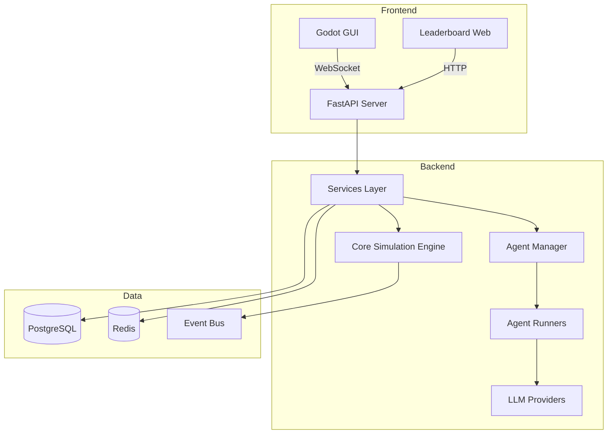

# FBA-Bench Enterprise - AI Context

> **Last Updated**: 2026-01-05
> 
> This file provides essential context for AI assistants to understand and navigate this codebase.

## Project Overview

**FBA-Bench Enterprise** is an advanced benchmarking framework for evaluating AI agents in complex business simulations, focusing on e-commerce fulfillment (FBA = Fulfillment by Amazon style), strategic decision-making, and multi-agent interactions.

### Tech Stack
- **Language**: Python 3.9-3.12
- **Package Manager**: Poetry (`pyproject.toml`)
- **API**: FastAPI with WebSocket support
- **Database**: SQLite (dev) / PostgreSQL (prod) via SQLAlchemy + Alembic
- **GUI**: Godot 4.5+ (GDScript)
- **Observability**: OpenTelemetry, Prometheus, ClearML
- **Deployment**: Docker Compose, Cloudflare Tunnel

## Key Directories

| Directory | Purpose |
|-----------|---------|
| `src/` | Core Python packages - **most code lives here** |
| `src/fba_bench_core/` | Core simulation engine, market models, agent interfaces |
| `src/fba_bench_api/` | FastAPI server, routes, WebSocket handlers |
| `src/agents/` | Agent implementations and memory systems |
| `src/agent_runners/` | Unified runner wrappers (LangChain, CrewAI, etc.) |
| `src/scenarios/` | Business simulation scenarios |
| `src/services/` | Business logic layer (dashboard, leaderboard, etc.) |
| `src/benchmarking/` | Metrics, validators, golden masters |
| `godot_gui/` | Godot 4 visualization GUI |
| `tests/` | Unit, integration, and contract tests |
| `infrastructure/` | Deployment scripts, Terraform, tenant provisioning |
| `docs/` | Documentation (architecture, API, ops guides) |
| `config/` & `configs/` | YAML configuration files |
| `scripts/` | Utility and automation scripts |
| `golden_masters/` | Reproducibility baseline results |

## How to Run

```bash
# Install dependencies
poetry install

# Start API server (dev)
python api_server.py
# or
make be-server

# Run tests
make test-all

# Start Godot GUI
python launch_godot_gui.py

# Docker (production)
docker-compose -f docker-compose.prod.yml up
```

## Architecture Patterns



## Important Conventions

1. **Service Layer**: All business logic goes through `src/services/`
2. **Event-Driven**: Simulation events flow through `src/fba_events/`
3. **Agent Registry**: Agents register via `AgentRegistry` in `src/agents/`
4. **Config-First**: Scenarios and experiments use YAML configs in `config/`

## 🚀 Investment Readiness (2026-01-07)

**Version**: 1.0.0-rc1 (Release Candidate)

All critical investment due diligence issues have been resolved:

| Issue | Resolution |
|-------|------------|
| Hardcoded Redis password | ✅ Uses `${REDIS_PASSWORD}` env var |
| Placeholder security email | ✅ security@fba-bench.com |
| License classifier mismatch | ✅ Fixed to Proprietary License |
| Test collection errors | ✅ Fixed with pytest.importorskip |
| In-memory experiment storage | ✅ `ExperimentRunStore` with Redis backend |

**Investment Score**: 8.75/10 ✅ DEFINITE YES

## ⚠️ Known Issues (Audit 2026-01-05)

All critical and medium priority issues have been resolved:

| Issue | Location | Status |
|-------|----------|--------|
| Test collection errors | `src/services/mock_service.py`, `trust_score_handler.py` | ✅ Fixed |
| Leaderboard stubs | `godot_gui/scenes/leaderboard/Leaderboard.gd` | ✅ Implemented |
| Theme toggle | `godot_gui/scenes/main/Main.gd` | ✅ Implemented |
| Volatility tracking | `src/scenarios/scenario_engine.py` | ✅ Implemented |

## Related Files


- [README.md](file:///c:/Users/admin/GitHub-projects/fba/FBA-Bench-Enterprise/README.md) - Public-facing project overview
- [DEV_SETUP.md](file:///c:/Users/admin/GitHub-projects/fba/FBA-Bench-Enterprise/DEV_SETUP.md) - Developer setup guide
- [docs/architecture.md](file:///c:/Users/admin/GitHub-projects/fba/FBA-Bench-Enterprise/docs/architecture.md) - Detailed architecture
- [CONTRIBUTING.md](file:///c:/Users/admin/GitHub-projects/fba/FBA-Bench-Enterprise/CONTRIBUTING.md) - Coding standards

---

*See `.agent/context_template.md` for the subdirectory context file format.*
